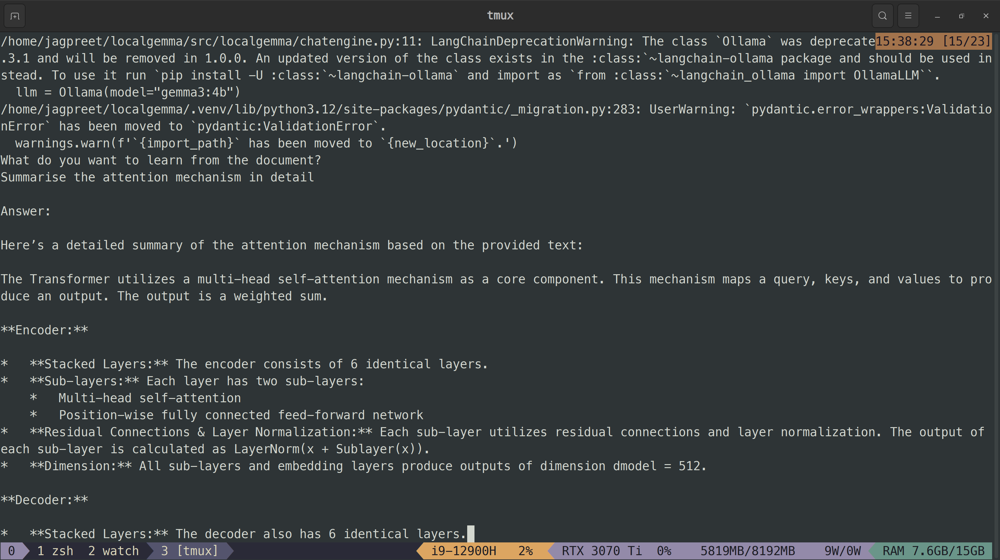

# PDF Chatbot using LangChain, Ollama, and RAG

This application allows you to interact with a PDF document using natural language queries. It leverages **LangChain** for orchestration, **Ollama** to serve LLMs locally, and implements a **Retrieval-Augmented Generation (RAG)** pipeline to answer questions based on PDF content.

---

## 🛠️ Technologies Used

- **[LangChain](https://www.langchain.com/)** – Framework for building applications with LLMs.
- **[Ollama](https://ollama.com/)** – Local model serving for LLMs.
- **Gemma 3B:4b (via Ollama)** – Used as the Large Language Model (LLM).
- **BGE-M3:567M** – Used as the embedding model for document vectorization and retrieval.
- **uv** – A modern Python package runner for quick script execution.

---

## 🚀 Getting Started

### 1. Run the installer

```bash
./install.sh
```

 `uv run test` for sanity check

 `uv run chat --path_to_pdf` to chat with the model with the PDF document as RAG



